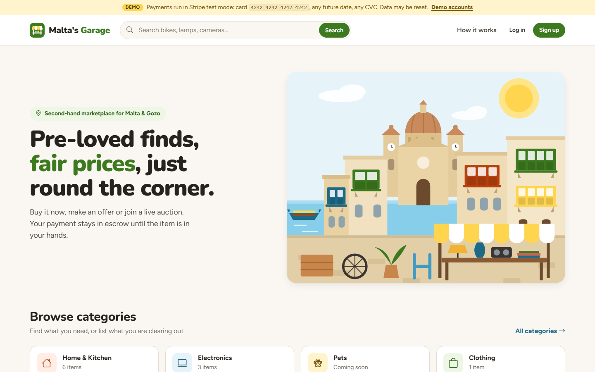
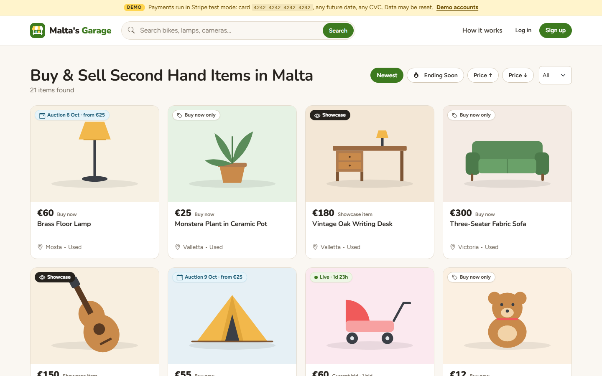
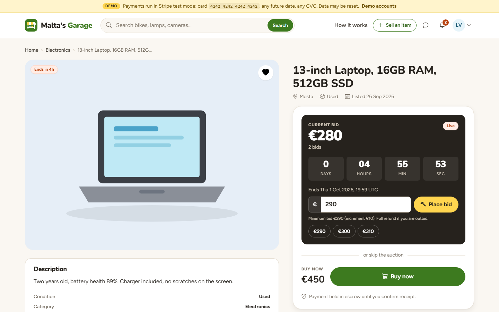
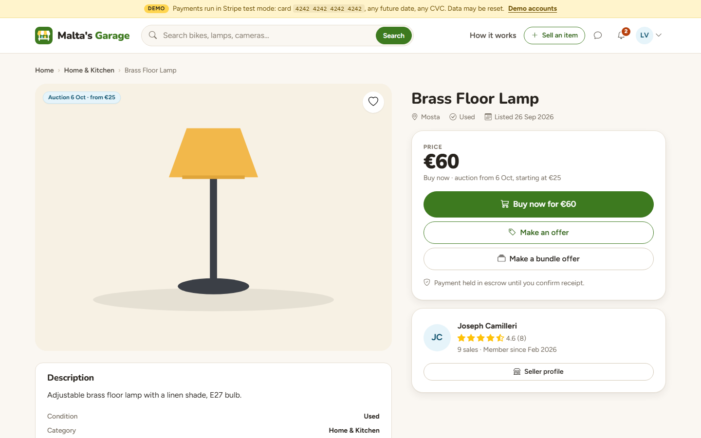
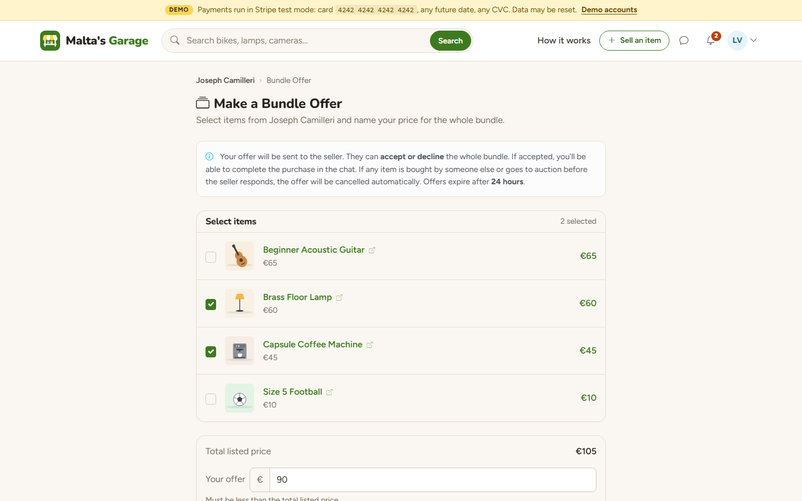
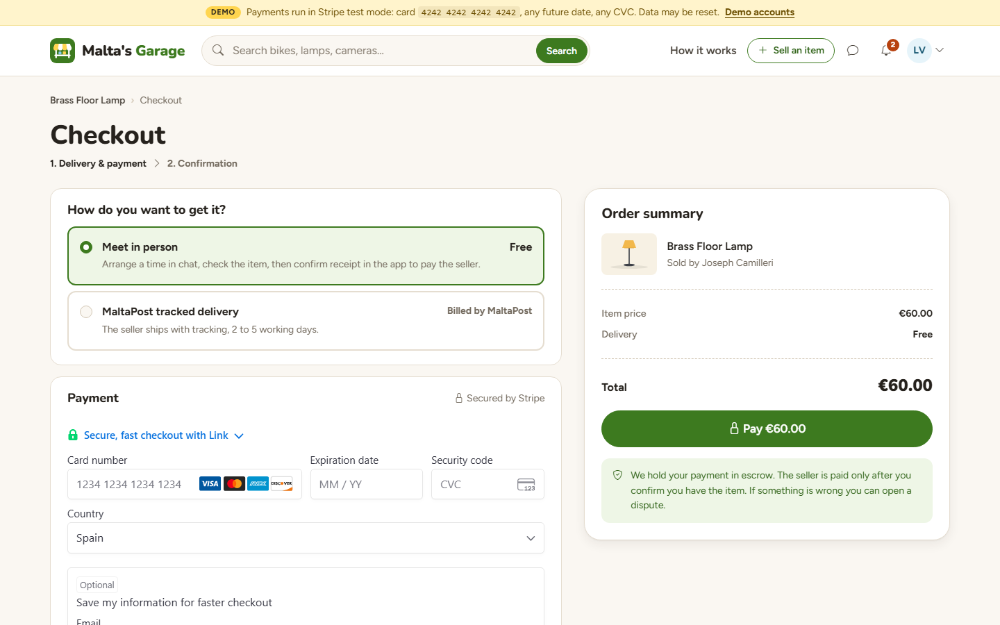
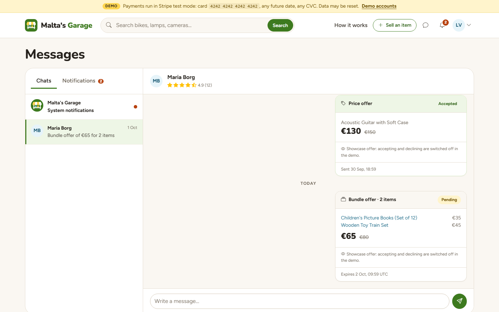
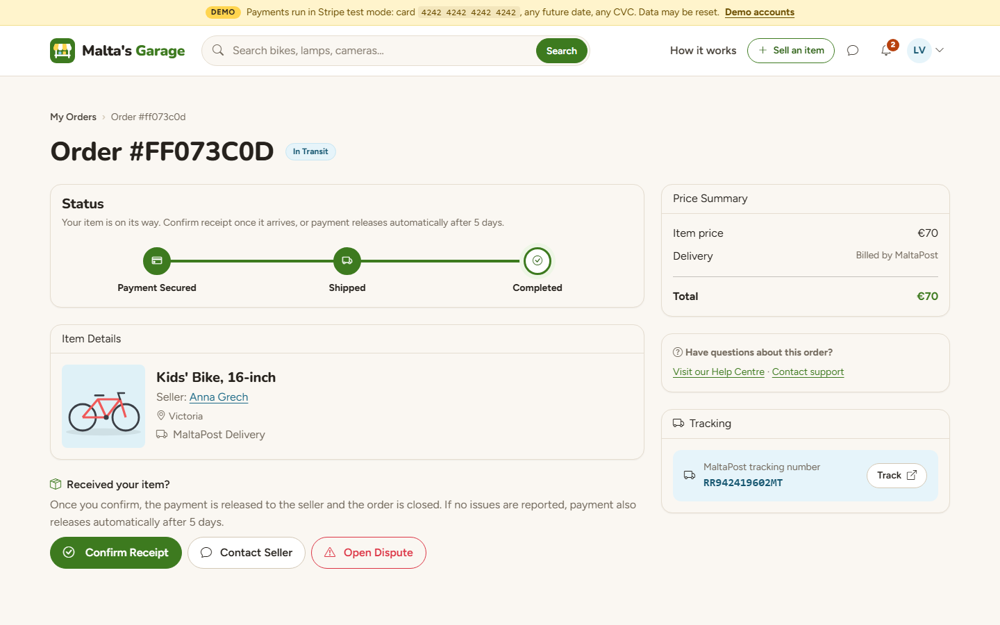
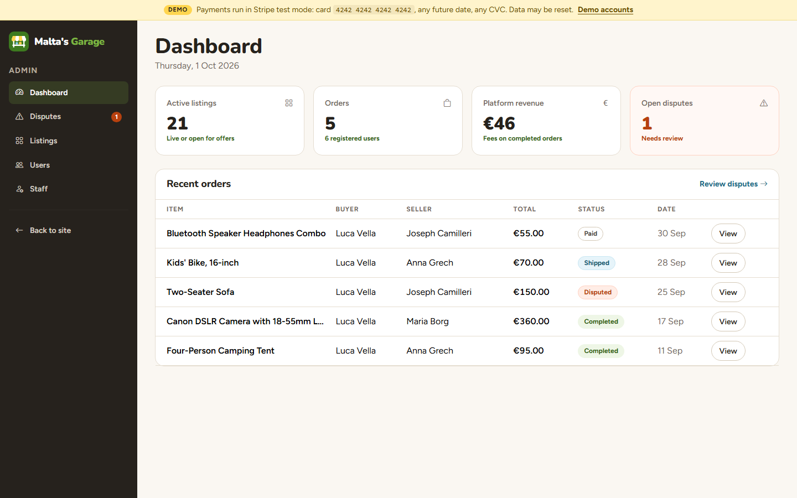
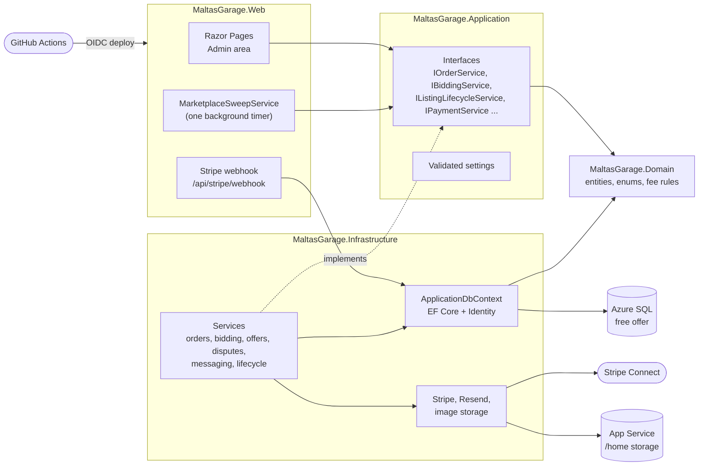

# Malta's Garage

[](https://github.com/ihorhavrysh/maltas-garage/actions/workflows/ci-cd.yml)


A second-hand marketplace for Malta and Gozo: fixed prices, price offers, bundle offers and
live auctions, with every payment held in escrow until the buyer has the item.
ASP.NET Core Razor Pages, Clean Architecture, EF Core, SQL Server and Stripe Connect.



## Live demo

**https://maltas-garage-demo.azurewebsites.net**

| Account | Email | Password |
|---|---|---|
| Buyer | `demo-buyer@example.com` | `Demo1234` |
| Seller | `demo-seller@example.com` | `Demo1234` |
| Admin | `demo-admin@example.com` | `Demo1234` |

- Payments run in Stripe test mode: card `4242 4242 4242 4242`, any future date, any CVC.
- The demo runs on free Azure tiers, so the first request after a quiet period can take
  30-60 seconds while the app and the database wake up.
- Demo data resets every 7 days. Listings marked **Showcase** are read-only examples that always
  show one state of the marketplace (a live auction with bids, an accepted offer, a bundle offer,
  a sold item with reviews).

## History

Malta's Garage was launched in production at maltasgarage.com with live Stripe Connect payments.
After relocating from Malta to Spain, I moved it to a free demo environment (Stripe test mode,
demo data) and keep it as a portfolio project.

## Screenshots

| | |
|---|---|
|  Browse with auction, buy-now and showcase badges |  Live auction with countdown and bid shortcuts |
|  Buy now, make an offer or a bundle offer |  Bundle offer on several items from one seller |
|  Checkout with Stripe Payment Element |  Chat with offer cards and system notifications |
|  Order tracking, receipt confirmation and disputes |  Admin dashboard |

## Features

**Buying and selling**
- Listings with photos (resized and thumbnailed with ImageSharp), categories, condition and location
- Three ways to buy: buy now, a price offer on one listing, or a bundle offer on several listings
  from the same seller; offers expire after 24 hours
- Timed auctions: a listing can open for bidding on a set date, bids are paid up front and the
  outbid bidder is refunded automatically, the winner gets an order when the auction ends
- Search with live suggestions, category pages, filters and sorting, favourites
- Seller profiles with ratings, reviews from both sides after a completed order

**Orders and payments**
- Stripe Connect (Express accounts) with escrow: the platform charges the buyer, then transfers
  the seller's payout when the buyer confirms receipt; the platform keeps a 10% fee (minimum EUR 1)
- Two delivery options: MaltaPost with a tracking number, or meeting in person
- Automatic escrow release if the buyer does not react: 5 days after shipping (MaltaPost) or
  7 days after payment (in person)
- Disputes with photo attachments, resolved by staff as a full refund, a partial refund or a
  payout to the seller; orders can be cancelled under the MaltaPost shipping rules

**Communication**
- In-app chat between buyer and seller, with offers shown as cards inside the conversation
- System notifications (outbid, auction won, item sold, order shipped, payout released) with an
  unread counter in the header
- Email notifications per user preference, plus transactional emails (order confirmation,
  password reset)

**Administration**
- Admin area with `Admin` and `Manager` roles: dashboard, disputes, user ban and unban, listing
  removal, staff management (Admin only)

**Demo mode**
- Demo accounts, seeded data, permanent showcase listings, a weekly reset, a demo banner, guards
  that keep demo accounts and showcase listings from being changed, and rate limits on bids,
  uploads and the contact form

## Tech stack

| Area | Technology |
|---|---|
| Backend | .NET 10, ASP.NET Core Razor Pages, ASP.NET Core Identity |
| Data | Entity Framework Core 10, SQL Server (Azure SQL in the demo) |
| Payments | Stripe Connect, Stripe Payment Element, webhooks |
| Images | SixLabors.ImageSharp, local disk or Azure Blob Storage |
| Email | Resend API (a logging sender in development and in the demo) |
| Frontend | Bootstrap 5, Bootstrap Icons, plain JavaScript |
| Tests | xUnit, EF Core InMemory and SQLite, WebApplicationFactory |
| Hosting | Azure App Service (Linux, Free F1), Azure SQL Database free offer |
| CI/CD | GitHub Actions, OpenID Connect login to Azure, Docker Compose check |

## Architecture

The solution follows Clean Architecture: the domain has no dependencies, the application layer
defines interfaces, infrastructure implements them, and the web project only composes and
presents.



## Technical decisions worth a look

**Auctions that close correctly on a host that sleeps.** The free App Service tier unloads the
app when it is idle and gives it 60 CPU minutes a day, so timers cannot be trusted to fire on
time. Time-based transitions (auction opens, auction closes with a winner, listing expires, offer
expires, escrow is released) live in one `ListingLifecycleService`. Every page that acts on a
listing first calls `EnsureCurrentAsync`, so an auction past its end time is closed the moment
anyone looks at it. A single `MarketplaceSweepService` catches up on everything else when the app
starts and every 15 minutes while it is awake; it replaced four separate polling services. Each
transition is idempotent and guarded by concurrency tokens on `Listing` and `Order`, so a
request and a sweep racing each other cannot close an auction twice.
See [`IListingLifecycleService`](src/MaltasGarage.Application/Common/Interfaces/IListingLifecycleService.cs).

**Escrow with Stripe Connect.** Payments are separate charges and transfers: the buyer pays the
platform, and the seller's payout is a `Transfer` created only when escrow is released. The
transfer is linked to the original charge (`source_transaction`) and sent with an idempotency key
per order, so a manual release racing the automatic one cannot pay the seller twice. Refunds,
partial refunds from disputes and outbid refunds all go back through the same payment service.
See [`StripePaymentService`](src/MaltasGarage.Infrastructure/Services/StripePaymentService.cs)
and [`OrderService`](src/MaltasGarage.Infrastructure/Services/OrderService.cs).

**Pluggable image storage.** `IImageService` has a local disk and an Azure Blob implementation,
chosen by the `Storage:Provider` setting. The demo stores uploads on the persistent `/home`
volume of App Service, outside the read-only deployment package.

**Showcase listings.** A public demo gets messy: visitors buy items, outbid each other and accept
offers. Showcase listings are flagged in the database, guarded against any change, and refreshed
by the sweep (an auction that would end soon is moved forward), so the interesting states are
always there to look at. Everything else resets weekly.

**Configuration.** Every settings section is bound to a class and validated at startup, so a
missing Stripe key stops the app with a clear message instead of failing on the first payment.
Secrets live in User Secrets locally and in App Service settings in Azure;
[`appsettings.Example.json`](src/MaltasGarage.Web/appsettings.Example.json) lists every key.

## Running locally

### With Docker Compose

```bash
docker compose up --build
```

Open http://localhost:8080 and log in with one of the demo accounts above. Compose starts SQL
Server, applies the migrations and seeds the demo data. Browsing works out of the box; to pay with
the test card, copy [`.env.example`](.env.example) to `.env` and fill in your own Stripe test
keys.

### With the .NET SDK

Requirements: .NET 10 SDK and SQL Server LocalDB (or any SQL Server).

```bash
cd src/MaltasGarage.Web
dotnet user-secrets set "Stripe:SecretKey" "sk_test_..."
dotnet user-secrets set "Stripe:PublishableKey" "pk_test_..."
dotnet user-secrets set "Stripe:WebhookSecret" "whsec_..."
dotnet run
```

The database is created and migrated on startup. To run with demo data, also set
`Demo:Enabled` to `true` and `Demo:SellerStripeAccountId` to a test-mode Connect account.
For webhooks, forward them with the Stripe CLI to the URL `dotnet run` prints, for example
`stripe listen --forward-to http://localhost:5225/api/stripe/webhook`.

## Tests

```bash
dotnet test
```

The suite covers the lifecycle transitions (auction closing, offer expiry, escrow release and
their races), bidding rules, purchases finished by the return page or the webhook, order and
escrow logic (refunds, one payout per order), reviews, image metadata stripping, showcase guards,
settings validation, and page-level permission checks that run the whole app on SQLite.
CI reports line coverage on each run.

## Deployment

Every push to `main` runs [the CI/CD workflow](.github/workflows/ci-cd.yml): build, tests, a
Docker Compose start-up check, then a deployment to Azure App Service. GitHub Actions logs in to
Azure with OpenID Connect, so the repository holds no Azure credentials, and the job finishes with
a smoke test against the live site. The deploy waits for the Docker Compose job, the one that
migrates a real SQL Server database. The Azure resources are described in
[`infra/main.bicep`](infra/main.bicep); known gaps are listed in [docs/open-items.md](docs/open-items.md).

## License

[MIT](LICENSE)
